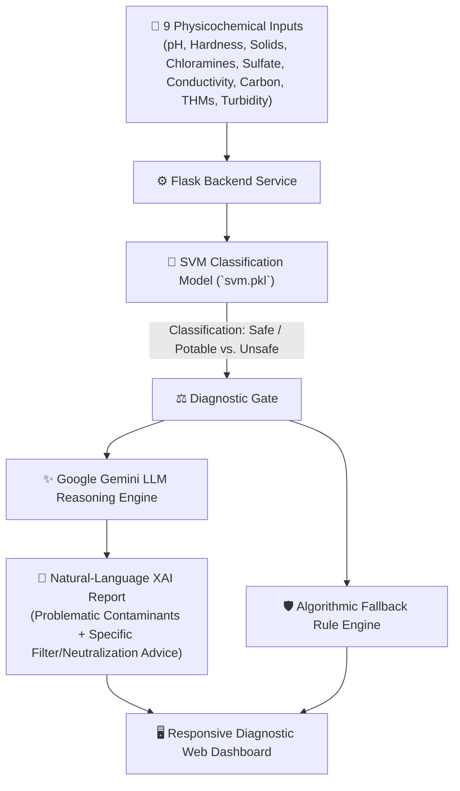

# 💧 Explainable Water Quality Prediction & Safety Diagnostic System

<div align="center">

[](https://python.org)
[](https://scikit-learn.org/)
[](https://ai.google.dev/)
[](https://flask.palletsprojects.com/)
[](https://sdgs.un.org/goals/goal6)
[](LICENSE)

**An intelligent, Explainable AI (XAI) water potability diagnostic tool combining Support Vector Machines (SVM) with Large Language Models (LLMs) to classify water safety and generate actionable chemical remediation guidance.**

</div>

---

## 📌 Overview

Access to clean, potable drinking water is a fundamental human right aligned with **UN Sustainable Development Goal 6 (Clean Water and Sanitation)**. 

Standard machine learning models often operate as "black boxes"—classifying water as *Unsafe* without clarifying *why* or *what corrective action to take*. 

The **Explainable Water Quality Prediction System** pairs a trained **Support Vector Machine (SVM)** classifier with **Google Gemini Generative AI** to deliver both binary potability assessments and clear, natural-language diagnostic reports explaining parameter anomalies and purification recommendations.

---

## 🏗️ System Architecture



---

## 🔬 Physicochemical Parameters Analyzed

| Parameter | Standard Range (WHO) | Significance |
| :--- | :--- | :--- |
| **pH** | $6.5 - 8.5$ | Evaluates acid-base equilibrium; extremes corrode pipes or taste bitter |
| **Hardness** | $< 300\ mg/L$ | Dissolved calcium and magnesium salt concentrations |
| **Solids (TDS)** | $< 1000\ mg/L$ | Total dissolved inorganic mineral matter |
| **Chloramines** | $< 4\ mg/L$ | Disinfectant residuals from municipal water treatment |
| **Sulfate** | $< 250\ mg/L$ | Naturally occurring minerals; excessive levels cause laxative effects |
| **Conductivity** | $< 400\ \mu S/cm$ | Electrical conductance indicating ion dissolved substance density |
| **Organic Carbon** | $< 10\ mg/L$ | Total organic carbon (TOC) levels |
| **Trihalomethanes**| $< 80\ \mu g/L$ | Disinfection by-products formed when chlorine reacts with organics |
| **Turbidity** | $< 5\ NTU$ | Cloudiness from suspended particulate matter |

---

## 🚀 Key Features

- **🎯 Machine Learning Potability Classifier**: High-precision Support Vector Machine (`svm.pkl`) evaluating multi-dimensional water chemistry.
- **🧠 Natural-Language Explainable AI (XAI)**: Synthesizes complex chemical indices into plain-English root causes via **Google Gemini**.
- **🛠️ Actionable Purification Advice**: Prescribes appropriate treatment mechanisms (e.g., reverse osmosis, activated carbon filters, UV purification, alkaline cartridges).
- **🌐 Responsive Web App & REST API**: Clean Flask interface supporting single-sample diagnostics and batch programmatic queries.
- **🛡️ Resilient Dual-Layer Reasoning**: Includes offline rule-based fallback if cloud LLM APIs are unreachable.

---

## 📂 Repository Structure

```bash
Explainable-Water-Quality-Prediction/
├── app.py                      # Flask server, prediction controller & Gemini XAI integration
├── svm.pkl                     # Serialized Support Vector Machine weights
├── Water_Quality_Prediction.ipynb # Jupyter exploration, EDA, feature scaling & training
├── requirements.txt            # Python dependencies
├── Templates/                  # HTML templates
│   └── index.html              # Diagnostic parameter input form & result view
├── static/                     # CSS stylesheets and branding assets
├── Project_Resources/          # Documentation, research papers & diagrams
└── README.md
```

---

## 🛠️ Quickstart Guide

### 1. Clone & Setup

```bash
# Clone the repository
git clone https://github.com/Manukrishna1971/Explainable-Water-Quality-Prediction.git
cd Explainable-Water-Quality-Prediction

# Create and activate virtual environment
python -m venv venv
source venv/bin/activate  # On Windows: .\venv\Scripts\activate

# Install dependencies
pip install -r requirements.txt
```

### 2. Configure Environment (Optional)
If using Google Gemini for live explanations, set your API key in `app.py` or as an environment variable:
```bash
export GEMINI_API_KEY="your-api-key-here"
```

### 3. Launch Flask App

```bash
python app.py
```
Open **[http://localhost:5000](http://localhost:5000)** in your browser.

---

## 📡 API Specification

### `POST /predict`
Send physicochemical measurements to receive potability status and explanation.

**Payload:**
```json
{
  "ph": 7.2,
  "hardness": 195.3,
  "solids": 18240.5,
  "chloramines": 6.8,
  "sulfate": 330.1,
  "conductivity": 420.2,
  "organicCarbon": 11.4,
  "trihalomethanes": 65.2,
  "turbidity": 3.8
}
```

**Response:**
```json
{
  "potability": "Safe",
  "explanation": "All critical physicochemical parameters are within acceptable WHO limits. Sulfate levels are slightly elevated but safe for consumption. Standard carbon block filtration recommended."
}
```

---

## 📄 License & Attribution

Distributed under the **MIT License**. Maintained by [Manukrishna](https://github.com/Manukrishna1971) and collaborators. Based on foundational water quality datasets adhering to open research principles.
